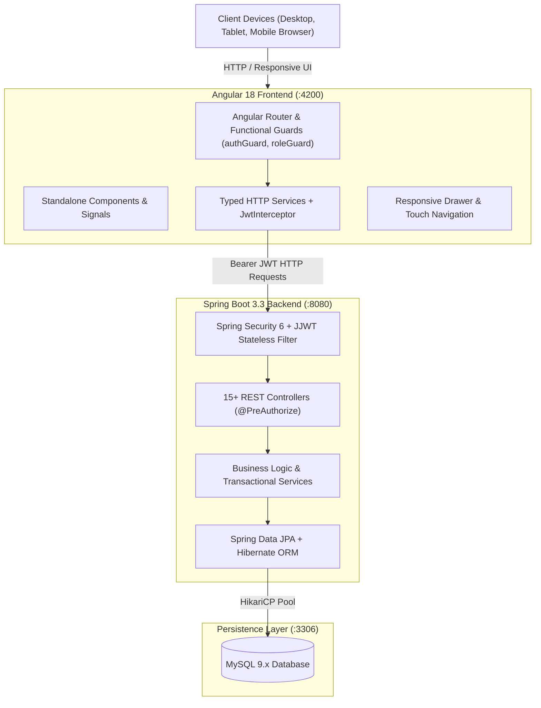

# 🏥 MedPulse Hospital Management System (HMS) - Full Stack Java & Angular

[](https://spring.io/projects/spring-boot)
[](https://angular.dev/)
[](https://www.oracle.com/java/)
[](https://www.mysql.com/)
[](LICENSE)

An enterprise-grade, full-stack Hospital Management System (HMS) built with **Spring Boot 3.3 (Java 21/22)**, **Angular 18**, **MySQL 9**, **Spring Security 6 + JJWT**, and **Bootstrap 5**. Designed for high clinical resilience, multi-tenant patient privacy, complex hospital operations, and seamless accessibility across **Desktop, Tablet, and Mobile devices**.

---

## 📋 Table of Contents
- [Architecture Overview](#-architecture-overview)
- [Key Features](#-key-features)
  - [Core Clinical Modules](#1-core-clinical-modules)
  - [12-Wing Operations Command Hub](#2-12-wing-operations-command-hub)
  - [Mobile & Tablet Optimization](#3-mobile--tablet-optimization)
- [Technology Stack](#-technology-stack)
- [Repository Structure](#-repository-structure)
- [Quick Start (Local Setup)](#-quick-start-local-setup)
- [Demo Credentials](#-demo-credentials)
- [REST API Reference](#-rest-api-reference)
- [Automated Testing & Postman](#-automated-testing--postman)
- [Cloud Deployment Guide](#-cloud-deployment-guide)

---

## 🏛️ Architecture Overview



---

## 🌟 Key Features

### 1. Core Clinical Modules
- **Authentication & RBAC**:
  - 4 Discrete System Roles: `ADMIN`, `DOCTOR`, `PATIENT`, `RECEPTIONIST`.
  - Stateless authentication with JJWT (HMAC-SHA512), encrypted passwords with BCrypt (strength 10).
  - Method-level security with `@PreAuthorize` and Angular route guards (`authGuard`, `roleGuard`).
- **Patient Management & Privacy**:
  - Full demographics, medical history timelines, emergency contacts, and blood groups.
  - Multi-tenant data scoping: Patients are isolated to **only view their own medical records, prescriptions, and billing**.
- **Doctor Scheduling & Dynamic Time Slots**:
  - Specialists directory with department, qualifications, experience, and consultation fees.
  - Configurable weekly availability schedules with dynamic 30-minute slot computation.
- **Appointment Booking & Overlap Prevention**:
  - Booking, rescheduling, status management (`BOOKED`, `CONFIRMED`, `COMPLETED`, `CANCELLED`, `RESCHEDULED`).
  - **Double-booking prevention**: Strict database-enforced transactional validation blocking duplicate bookings for the same doctor slot.
- **Clinical Records & Prescriptions**:
  - Doctors record diagnoses, symptoms, treatments, vitals, and lab orders.
  - Multi-drug itemized prescriptions with dosage, frequency, duration, and food instructions.
  - High-resolution printable prescription slips with hospital branding and signature areas.
- **Billing & Invoice Settlement**:
  - Auto-itemization formula: `Total = Consultation Fee + Medicine Charges + Lab Charges + Other Charges`.
  - Simulated multi-mode payment settlement via `CASH`, `CARD`, and `UPI`.
  - Tax invoice generator with print stylesheet.

### 2. 12-Wing Operations Command Hub
A centralized command dashboard delivering end-to-end departmental management:
1. 🛏️ **Bed & Ward Management**: Real-time bed occupancy, ICU/General/Private ward availability tracking.
2. 💊 **Pharmacy Inventory**: Medication stock levels, reorder alerts, expiry monitoring, and unit pricing.
3. 🧪 **Laboratory Diagnostic Tests**: Lab test catalog, diagnostic booking, and pathology workflow.
4. 🩺 **Surgery & OT Scheduling**: Operating theatre booking, lead surgeons, anesthesiologists, and procedure status.
5. 🩸 **Blood Bank Inventory**: Blood group inventory (A+, B+, O+, AB-, etc.), unit reservations, and expiry tracking.
6. 🛡️ **Insurance & Third-Party Claims**: Policy verification, claim filing, approved amounts, and settlement status.
7. 🚨 **Emergency Room (ER) Hub**: Triage classification (Immediate, Urgent, Delayed), attending physicians, and acute care tracking.
8. 👥 **Staff Duty Roster**: Nurse, doctor, and technician shift schedules (Morning, Evening, Night).
9. 🎫 **Patient Queue Management**: Real-time waiting room queue tokens, serving counter calls, and queue displays.
10. 💡 **Clinical Decision Support (CDSS)**: Drug-drug interaction checks, symptom triage recommendations, and critical vitals flags.
11. 📊 **Hospital Analytics Dashboard**: Revenue trends, bed occupancy ratios, daily patient admissions, and doctor caseload analytics.
12. 🔔 **Notification Dispatch Log**: Automated notification dispatch records (SMS, Email, Push) for appointments, lab results, and billing alerts.

### 3. Mobile & Tablet Optimization
- **Responsive Slide-Out Drawer**: The navigation sidebar smoothly shifts to a hardware-accelerated touch-friendly drawer on mobile viewports (`< 992px`) and remains docked on desktop (`≥ 992px`).
- **Mobile Hamburger Toggle**: One-tap navigation menu toggle in the top navbar for authenticated users.
- **Touch-Friendly Data Tables**: All clinical tables feature smooth horizontal scrolling (`-webkit-overflow-scrolling: touch`) and minimum readable widths so dense patient records never squash or break.
- **iOS & Android Input Ergonomics**: Standardized 16px input fonts to prevent iOS Safari auto-zoom bugs, touch target sizing (≥ 42px), and auto-dismissing modal overlays.

---

## 🛠️ Technology Stack

| Domain | Technology | Details |
|---|---|---|
| **Frontend Framework** | Angular 18 | Standalone components, Signals, Reactive Forms, TypeScript 5.5 |
| **Styling & UI** | Bootstrap 5.3 + Bootstrap Icons | Custom Glassmorphism, Aurora gradients, Responsive print stylesheets |
| **Backend Framework** | Spring Boot 3.3.3 | Java 21/22, Spring Data JPA, Hibernate 6.5, Spring Security 6 |
| **Security & JWT** | JJWT 0.12.5 | Stateless JWT authentication, BCrypt password hashing |
| **Database** | MySQL 8.0+ / 9.x | InnoDB, UTF8mb4, transactional isolation, foreign key constraints |
| **Connection Pool** | HikariCP | Cloud-resilient connection pooling with health testing |
| **Testing** | PowerShell Suites & Postman | 25-point automated security/RBAC test suite & Postman v2.1 collection |

---

## 📂 Repository Structure

```
Hospital-Management-System/
├── .gitignore                               # Root gitignore for build artifacts & dependencies
├── README.md                                # Comprehensive project documentation
├── Hospital_Management_System.postman_collection.json # Ready-to-import Postman API collection
├── test_full_stack_features.ps1             # Full-stack features verification script
├── test_receptionist.ps1                    # Receptionist & operations endpoints test script
├── backend/
│   ├── mvnw & mvnw.cmd                      # Cross-platform Maven wrapper
│   ├── pom.xml                              # Maven build configuration & dependencies
│   ├── Dockerfile                           # Multi-stage production container build
│   ├── Procfile                             # Cloud deployment start command
│   ├── test_final_review.ps1                # 25-point automated integration & security test suite
│   ├── test_enterprise_features.ps1         # 12-wing operations test suite
│   └── src/main/
│       ├── java/com/hospital/hms/
│       │   ├── config/                      # SecurityConfig, CorsConfig, DataInitializer
│       │   ├── controller/                  # REST Controllers (Auth, Patient, Doctor, Appointment, Bill, etc.)
│       │   ├── dto/                         # Request & Response Data Transfer Objects
│       │   ├── entity/                      # JPA Entities & Enums (15+ core and operational models)
│       │   ├── exception/                   # GlobalExceptionHandler & API error contracts
│       │   ├── repository/                  # Spring Data JPA repositories with query methods
│       │   ├── security/                    # AuthTokenFilter, AuthEntryPointJwt, UserDetails
│       │   └── service/                     # Service interfaces & transactional implementations
│       └── resources/
│           └── application.properties       # Environment variable-configurable settings
└── frontend/
    ├── package.json                         # Node dependencies and scripts
    ├── angular.json                         # Angular CLI project configuration
    ├── tsconfig.json                        # TypeScript configuration
    ├── vercel.json                          # Client-side SPA routing rewrites for Vercel
    └── src/
        ├── index.html                       # HTML5 entry with mobile viewport meta
        ├── styles.css                       # Global design system, glassmorphism, responsive utilities
        ├── environments/                    # Local and production environment configurations
        └── app/
            ├── core/                        # Auth guards, role guards, JWT interceptor, state services
            ├── models/                      # TypeScript domain models & interfaces
            ├── pages/                       # Feature pages (Dashboards, Appointments, Operations, Records, etc.)
            └── shared/                      # Navbar with mobile toggle, responsive offcanvas sidebar
```

---

## ⚡ Quick Start (Local Setup)

### Prerequisites
- **Java**: JDK 21 or 22
- **Node.js**: v18+ and `npm`
- **Database**: MySQL Server 8.0+ or 9.x running on port `3306`

---

### 1. Database Setup
Create the MySQL database:
```sql
CREATE DATABASE hospital_management_system;
```
*(The Spring Boot application will automatically generate all tables and seed default users on first boot).*

---

### 2. Backend Setup
Navigate to `backend` and launch using the included Maven wrapper:

**Windows (PowerShell/CMD):**
```powershell
cd backend
.\mvnw.cmd spring-boot:run
```

**Linux/macOS:**
```bash
cd backend
chmod +x mvnw
./mvnw spring-boot:run
```

*The backend API initializes on `http://localhost:8080/api`.*

---

### 3. Frontend Setup
Open a second terminal window, navigate to `frontend`, install dependencies, and start the development server:
```bash
cd frontend
npm install
npm start
```

*The Angular frontend launches on `http://localhost:4200`.*

---

## 🔑 Demo Credentials

The database is pre-seeded with sample users for all 4 roles:

| Role | Username | Password | Default Dashboard | Key Capabilities |
|---|---|---|---|---|
| **Admin** | `admin` | `admin123` | `/admin` | System overview, staff roster, revenue analytics, full directory access |
| **Doctor** | `doctor_smith` | `doctor123` | `/doctor` | Clinical workspace, appointments, medical records, multi-drug prescriptions |
| **Receptionist** | `receptionist_sarah` | `rec123` | `/receptionist` | Front desk counter, appointment booking, patient registration, billing & invoicing |
| **Patient** | `patient_john` | `patient123` | `/patient` | Patient portal, book visits, private medical history, prescriptions & bills |

---

## 📡 REST API Reference

| Module | Method | Endpoint | Access Level | Description |
|---|---|---|---|---|
| **Auth** | `POST` | `/api/auth/login` | Public | Authenticate user and receive Bearer JWT |
| **Auth** | `POST` | `/api/auth/register` | Public | Register new patient user account |
| **Patients** | `GET` | `/api/patients` | Admin, Doctor, Receptionist | List all registered patients |
| **Patients** | `GET` | `/api/patients/{id}` | Role Protected / Self | Get patient profile & medical history |
| **Doctors** | `GET` | `/api/doctors` | Authenticated | List specialist doctors & departments |
| **Doctors** | `GET` | `/api/doctors/{id}/availability` | Authenticated | Get weekly availability schedules |
| **Appointments** | `GET` | `/api/appointments` | Role Scoped | List appointments |
| **Appointments** | `POST` | `/api/appointments` | Authenticated | Book appointment (Double-booking protected) |
| **Appointments** | `PATCH` | `/api/appointments/{id}/status` | Doctor, Receptionist | Update status (`CONFIRMED`, `COMPLETED`, `CANCELLED`) |
| **Records** | `POST` | `/api/medical-records` | Doctor | Create clinical medical record & diagnosis |
| **Prescriptions** | `POST` | `/api/prescriptions` | Doctor | Issue multi-drug itemized prescription |
| **Billing** | `POST` | `/api/bills` | Admin, Receptionist | Generate auto-calculated invoice |
| **Billing** | `POST` | `/api/bills/{id}/settle` | Admin, Receptionist | Settle bill via `CASH`, `CARD`, or `UPI` |
| **Operations** | `GET` | `/api/beds` | Staff | Bed inventory & ward occupancy |
| **Operations** | `GET` | `/api/medicines` | Staff | Pharmacy inventory & stock tracking |
| **Operations** | `GET` | `/api/lab-tests` | Staff | Laboratory diagnostic test directory |
| **Operations** | `GET` | `/api/emergency/active` | Staff | Active emergency room triage cases |
| **Operations** | `GET` | `/api/surgery` | Staff | Operating theatre & surgery schedule |
| **Operations** | `GET` | `/api/blood-bank` | Staff | Blood bank unit levels & reservations |
| **Operations** | `GET` | `/api/insurance` | Staff | Insurance claims & approval workflows |
| **Operations** | `GET` | `/api/staff-roster` | Staff | Shift duty assignments across departments |
| **Analytics** | `GET` | `/api/analytics` | Admin | Aggregate hospital metrics & revenue stats |

---

## 🧪 Automated Testing & Postman

### Automated Test Suites
Run the automated end-to-end integration and security test suite:
```powershell
cd backend
powershell -ExecutionPolicy Bypass -File .\test_final_review.ps1
```
*Result: 25 / 25 Passed (Verifies RBAC, double-booking prevention, multi-tenant isolation, and JWT security).*

Run the 12-wing operations command hub test suite:
```powershell
powershell -ExecutionPolicy Bypass -File .\test_receptionist.ps1
```

### Postman Collection
Import `Hospital_Management_System.postman_collection.json` into Postman:
- Includes pre-configured environment variables (`baseUrl`, `token`).
- Token inheritance automatically attaches Bearer JWTs to secured requests.
- Contains positive and negative test cases with assertion scripts.

---

## 🚀 Cloud Deployment Guide

### 1. Database (Managed Cloud MySQL)
Deploy on **Railway**, **Aiven**, or **AWS RDS**:
- Set database name: `hospital_management_system`
- Save JDBC connection URL, username, and password.

### 2. Full-Stack Unified Deployment (Render - 1 Single Service for Everything)
1. Push repository to GitHub.
2. In **Render** (dashboard.render.com), click **New +** ➔ **Web Service**.
3. Connect repository: `Lokesh3454/Hospital_Management_System`.
4. Render automatically detects the root multi-stage `Dockerfile`.
5. Set Environment Variables:
   - `SPRING_DATASOURCE_URL`: `jdbc:mysql://<host>:<port>/<dbname>?useSSL=true&serverTimezone=UTC`
   - `SPRING_DATASOURCE_USERNAME`: `<db_username>`
   - `SPRING_DATASOURCE_PASSWORD`: `<db_password>`
   - `PORT`: `8080`
6. Click **Create Web Service**.
7. Both Frontend UI and Backend API will be live on your single Render URL (e.g., `https://your-hms.onrender.com`), with zero CORS issues!

### 3. Alternative: Split Deployment (Frontend on Vercel + Backend on Render)
- **Frontend on Vercel**: Import repo, set Framework Preset to **Angular**, Output Directory to `dist/frontend`.
- **Backend on Render**: Point to `backend/` directory with Docker.

---

## 📄 License
This project is open source and available under the [MIT License](LICENSE).
